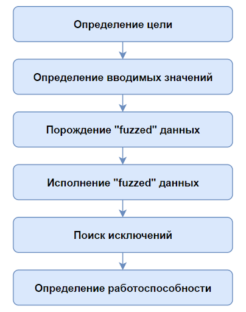
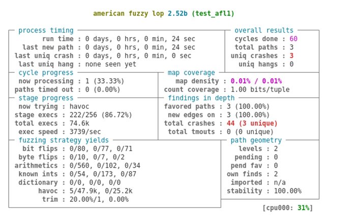
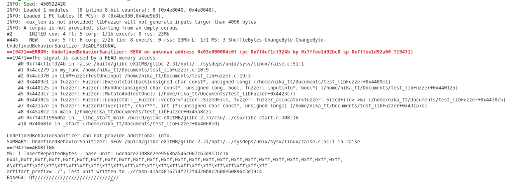

# Fuzz-testing. Описание, применение, основные этапы. Инструменты для тестирования AFL (American Fuzzy Lop) и libFuzzer

## Введение

**Fuzz-testing** (или фаззинг) - это далеко не новый вид тестирования, однако и в наши дни он остается эффективным способом проверки безопасности приложений и компьютерных систем. Название этого вида тестирования говорит само за себя: *"fuzz-testing"* можно перевести как *“нечеткое тестирование”*. “Нечеткое” в данном контексте означает, что тестовые данные являются случайными, неопределенными, неверными. В данной статье мы подробно познакомимся с этим видом тестирования, рассмотрим возможности его применения и узнаем несколько инструментов для фаззинга.

## Определения и основные понятия

Давайте дадим более строгое определение понятию фаззинг: *"**fuzz-testing** - это техника тестирования программного обеспечения, часто автоматическая или полуавтоматическая, заключающаяся в передаче приложению на вход неправильных, неожиданных или случайных данных"*. Смысл тестирования в следующем - мы пытаемся обнаружить падения, зависания, нарушения логики, утечки памяти нашего приложения при получении таких данных.

**Фаззерами** мы будем называть средства, позволяющие автоматически проводить fuzz-testing.

Обычно выделяют два вида фаззеров:

- *случайные* (или глупые) - они генерируют случайные тестовые данные, проводимые тесты не зависят друг от друга.
- *с учетом покрытия* (или умные) - сгенерированные тестовые данные не случайны, так как для новых тестов используются результаты прошлых; цель - увеличение тестового покрытия.

Хотя случайные фаззеры проще и зачастую быстрее, мы в данной статье сосредоточимся на умных фаззерах, так как они являются более продвинутыми и позволяют в большей степени обеспечить полное тестовое покрытие.

## Основные этапы fuzz-testing

Как проводить тестирование? Существует много видов fuzz-testing, которые зачастую определяются целью тестирования. Однако для всех них можно выделить общие фазы, которые изображены на данной схеме:



Давайте рассмотрим немного подробнее каждый из этапов:

- **Определение цели**

    На первый взгляд кажется, что данная фаза не особо полезна. Но это лишь на первый взгляд. На самом деле существует огромное количество различных инструментов для проведения тестирования и все они имеют свои особенности. Для грамотного выбора необходимо оценить особенности вашего приложения и подобрать подходящий инструмент для конкретно ваших целей.
    
    *Примечание:* к сожалению, конкретные подходы к подбору инструментов мы не рассмотрим в данной статье, но далее будут описаны основные особенности двух популярных фаззеров.

- **Определение вводимых значений**

    В большинстве своем fuzz-testing ориентирован на пользовательский ввод, так как именно с ним зачастую и связано появление основных уязвимостей (например, обход каталога и инъекции SQL). На данном этапе тестировщику необходимо определить все точки ввода данных у выбранной цели. Это могут быть вводимые пользователем данные для веб-приложений, имена файлов, переменные среды, аргументы командной строки и т.д.

- **Порождение “fuzzed” данных**

    Под “fuzzed” данными здесь подразумеваются некорректные данные. На данном этапе необходимо решить, какой вид данных мы будем использовать. Это могут быть заранее предопределенные значения, различным образом измененные имеющиеся входные данные или динамически генерируемые значения. С точки зрения тестового покрытия лучшим вариантом является последний. Именно такой вариант и предлагают нам “умные” фаззеры.

- **Исполнение “fuzzed” данных**

    Это и есть ключевой момент тестирования. На вход объекта подаются сгенерированные на предыдущем этапе данные. Результаты данной процедуры рассматриваются на следующем этапе.

- **Поиск исключений**

    Данный этап заключается в мониторинге исключений в программе, вызванными поданными на вход данными. При использовании достаточно продвинутых фаззеров данный этап фактически выполняется за вас.

- **Определение работоспособности**

    После выявления проблемного места в коде принимается решении об исправлении ситуации или исключении сегмента с ошибкой. Данный этап обычно выполняется не тестировщиком.

Относительно основных этапов fuzz-testing важно отметить следующее: фазы *“порождение fuzzed данных”* и *“исполнение fuzzed данных”* могут и должны быть *автоматизированы*. Без автоматизации не получится провести достаточное количество тестов и данный процесс тестирования нельзя будет считать истинным фаззингом.

## Применение fuzz-testing и его ограничения

Основная цель применения фаззинга - это *увеличение тестового покрытия* вашего кода. Когда fuzz-testing может вам помочь? Если обобщать, то подходящими для тестирования являются следующие ситуации:

- *функции приложения, которые обрабатывают сложные данные*

    Примеры: десериализаторы, запросы к базам данных, парсеры.

- *любые элементы, принимающие данные из внешних источников*

    Примеры: ввод данных в приложение от пользователя через stdin, аргументы командной строки, запросы к серверу.

Дополнительно к области применения стоит озвучить ограничения fuzz-testing. Основные ошибки, которые может пропускать фаззинг:

- *Ошибки контроля доступа*

    В данном пункте подразумевается соблюдение прав для разных уровней пользователей. Так, фаззер может в процессе генерации входных данных назначить обычному пользователю права администратора.

- *“Тайные ходы”*

    Фаззер не может отличить правильный вход в систему от некорректного. Если в процессе генерации входных данных случайно подберется верный пароль для пользователя, то фаззер это никак не опознает.

- *Многоступенчатые уязвимости*

    Фаззинг вряд ли поможет выявить цепочку связанных уязвимостей, которые могут привести к атаке на приложение. Стоит иметь в виду, что фаззер хорошо определяет только отдельные уязвимости.

- *Повреждение памяти*

    Если при повреждении памяти тестируемое приложение не зависло, то обычный фаззер может не выявить каких-либо аномалий при текущем тесте и не сообщит об этом пользователю.

Вышеперечисленные ограничения применимы, в соновном, к примитивным фаззерам, у которых полностью отсутствует информация о структуре приложения, его внутренней логики. При проведении fuzz-testing всегда стоит иметь в виду данные особенности работы фаззеров.

Изучив основную информацию о fuzz-testing, мы можем перейти к реальным примерам - попробуем использовать на практике инструменты фаззинга.

## American Fuzzy Lop

**American Fuzzy Lop** (или сокращенно AFL) - в наши дни далеко не новый фаззер, но он получил большую популярность и до сих пор его можно считать стандартом для fuzz-testing. Он довольно прост в использовании, в чем мы сейчас убедимся на простом примере программы:

```c
#include <stdio.h>
#include <signal.h>
#include <string.h>

int main() {
    char a[100];
   
    scanf("%s", a);
    if (a[0] == 'A' && strlen(a) == 25) {
        raise(SIGSEGV);
    }
    if (a[0] == 'K' && strlen(a) == 60) {
        raise(SIGSEGV);
    }
    return 0;
}
```

Данную программу мы будем запускать под управлением AFL. Как можно видеть, в зависимости от ввода код может сгенерировать SEGFAULT. Такое поведение программы и должен “отловить” фаззер.

В данной статье не будет приводиться подробная информация об установке AFL. Для тех, кто захочет самостоятельно попробовать поработать с данным фаззером, доступна инструкция по [сслыке](https://afl-1.readthedocs.io/en/latest/INSTALL.html#install).

Далее нам необходимо собрать код нашей программы с помощью компилятора-обертки *afl-gcc*. Это связано с тем, что AFL внедряет в код специальные ассемблерные инструкции в точки ветвления для отслеживания поведения подопытной программы, позволяя определять, когда происходит переключение на новую ветвь исполнения и какие входные данные повлияли на это. Входные данные, повлиявшие таким образом на размер покрытия, сохраняются. Они послужат опорой для дальнейшей генерации данных.

```shell
afl-gcc test_afl.c -o test_afl # сборка программы с помощью afl-gcc
```

Далее необходимо создать пример входного файла. Их можно создать несколько, но для нашего теста будет достаточно одного:

```shell
mkdir input        # создание директории для входных данных
echo abcd > input/1 # добавление примера ввода для программы
```

После всех приготовлений можно запустить фаззер:

```shell
afl-fuzz -i input -o output -- ./test_afl 
```

Флаг *-i* позволяет указать папку с примерами входных данных, а *-o* - папку для выходных данных фаззера.

После запуска фаззера нам показывается следующее “окно”:



Мы видим статистику по процессу тестирования в реальном времени, самым важным параметром в ней для нас является **total crashes** - количество найденных “крахов” нашей программы. В данном случае мы имеем показатель *“3 unique”* - то есть найдено три уникальные проблемы, информация о которых содержится в папке output.

После проведения тестирования давайте посмотрим на найденные входные данные, приведшие к краху программы, в папке *output/crashes*:


Как мы видим, действительно были обнаружены все ситуации, которые могли привести к проблемам в коде:

- первый символ А и длина 25 символов;
- первый символ К и длина 60 символов;
- слишком большая входная строка (буфер рассчитан максимум на 100 символов).

Посмотрев на работу AFL на простом примере перейдем к более новому представителю фаззеров - *libFuzzer*.

## libFuzzer

**libFuzzer** - это инструмент fuzz-testing, который работает с учетом покрытия и находится в процессе разработки.

В отличие от AFL, для использования libFuzzer недостаточно просто его установить и запустить. Нам необходимо прописать так называемые **“точки входа фаззера”** - специальные функции, которые будет запускать фаззер. Теперь код нашей тестовой программы будет выглядеть следующим образом:

```c
#include <stdio.h>
#include <signal.h>
#include <string.h>
#include <inttypes.h>

int my_func() {
    char a[100];
   
    scanf("%s", a);
    if (a[0] == 'A' && strlen(a) == 25) {
        raise(SIGSEGV);
    }
    if (a[0] == 'K' && strlen(a) == 60) {
        raise(SIGSEGV);
    }
    return 0;
}

int LLVMFuzzerTestOneInput(const uint8_t* data, size_t size) {
  my_func((char*)data);
  return 0;
}
```

*Примечание:* в данном коде функция LLVMFuzzerTestOneInput - точка входа для фаззера.

Далее необходимо скомпилировать программу с помощью clang, указав использование фаззера, и запустить:

```shell
clang -g -fsanitize=fuzzer test_lifFuzzer.c -o test_lifFuzzer
./test_lifFuzzer
```

Практически моментально мы получаем результат:



В конце данного вывода программы мы видим входные данные, вызвавшие ошибку - строка, начинающаяся с символа A и длиной 25 символов. Если указать дополнительные санитайзеры при компиляции программы, то будет доступна дополнительная информация (например, трассировка стека). При исправлении данной “ошибки” и повторном запуске фаззера будут обнаружены остальные проблемные ситуации, найденные ранее инструментом AFL.

Рассмотрев оба фаззера перейдем к небольшому резюме - *сравнительному анализу* этих инструментов.

## Сравнительный анализ libFuzzer и AFL

Выбор данных двух инструментов не случайный - они являются одними из самых ярких представителей **Greybox фаззеров**. Фаззеры этого вида получают не только информацию о падении/зависании программы, но и информацию о ходе исполнения программы. Данный тип фаззеров является, по мнению автора статьи, золотой серединой между примитивными *Blackbox фаззерами* и сложными *Whitebox фаззерами* (они трудны в применении и обладают высокими требованиями к ресурсам).

В качестве основных особенностей *American Fuzzy Lop* и *libFuzzer* можно выделить следующее:

- **Присутствует процесс инструментации кода** - это позволяет собирать большое количество информации о тестовом покрытии программы.
- **Довольно просты в использовании** (в чем можно было убедиться на примерах выше).
- **Являются умными фаззерами** - основываются при мутации данных на ранее полученных результатах и стремятся максимизировать тестовое покрытие.
- **Обладают хорошей эффективностью**, что доказано на практике.
- **Обладают хорошей масштабируемостью**.

Несмотря на свою схожесть, libFuzzer и AFL имеют важные отличия, которые необходимо учитывать при выборе средства для фаззинга:

- *AFL более популярен, чем libFuzzer*. Дело в том, что в свое время AFL стал важным этапом в области развития фаззинга и получил большое распространение. Для AFL существует огромное множество написанных модификаций, что делает его удобным инструментом для решения различных задач.

- *AFL требует отдельной установки, а libFuzzer - поставляется совместно с Clang*, что является плюсом в копилку libFuzzer.

- *AFL практически не имеет возможностей настройки для пользователя*. Если требуются дополнительные возможности фаззера, то придется устанавливать отдельно модификации для AFL. LibFuzzer, в свою очередь, предоставляет возможность пользователю выбирать различные параметры. Кроме того, он тесно интегрирован с различными дезинфицирующими средствами, которые можно дополнительно подключать в процессе фаззинга.

- *У данных двух фаззеров разные режимы работы. У AFL это “Fork mode”, а у libFuzzer - “Persistance mode”*.

    В первом случае при тестировании процесс запускается один раз, а для каждого отдельного теста создается форк процесса. Это намного быстрее, чем создавать для каждого варианта тестового ввода новый процесс, так как мы пропускаем его инициализацию.
    
    При Persistent mode процесс создается только один, а тестируемая функция просто помещается в цикл, в котором происходит подмена ее аргументов на новые тестовые данные. Этот способ быстрее, чем Fork mode, однако отдельные тестовые исполнения функции перестают быть независимыми и есть большой риск изменения состояния процесса и наведенных ошибок. Поэтому обычно после определенное количества исполнения цикла процесс пересоздается.

Для лучшего сравнения данные характеристики представлены в таблице:

| Характеристика | AFL | libFuzzer |
| ----------- | ----------- | ---------- |
| Популярность | +++ | ++ |
| Простота использования | +++ | ++ |
| Простота установки| ++ | +++ |
|Возможность настройки| + | +++ |
|Режим работы| Fork mode | Persistance mode |

## Выводы
В данной статье мы рассмотрели такой вид тестирования, как *fuzz-testing*. Фаззинг будет уместно применять для тестирования приложений с *любой формой ввода внешних (пользовтельских) данных* или с *функциями, обрабатывающими сложные данные*. Хочу отметить, что *не стоит пытаться вручную* генерировать и запускать тесты (третья и четвертая фазы fuzz-testing), так как вы не сможете добиться нужного объема и разнообразия тестов, которых требует fuzz-testing. Всегда следует использовать специальные инструменты - *фаззеры*.

Всего было рассмотрено два инструмента из группы Greybox фаззеров - *American Fuzzy Lop* и *libFuzzer*. Данные фаззеры являются довольно популярными и не требуют особых дополнительных знаний для их использования. По сравнению друг с другом каждый из них имеет свои достоинства и недостатки, поэтому при выборе конкретного фаззера стоит во многом руководствоваться целью тестирования. 

Fuzz-testing уже давно доказал на практике свою эффективность. Чтобы убедиться в этом, можно взглянуть на [список](http://lcamtuf.coredump.cx/afl/#bugs) уязвимостей, найденных с помощью AFL. К сожалению, многие до сих пор пропускают этап фаззинга при тестировании своих приложений. Надеюсь, в будущем fuzz-testing станет еще более популярным и укрепит свои позиции в ряду других основных способов тестирования ПО.
